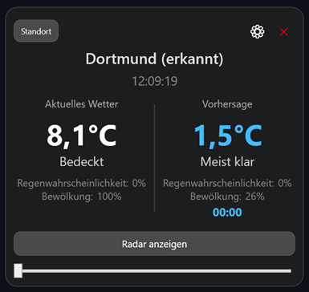

# Weather Viewer



A modern, desktop **weather application** built with WPF and .NET.
The application provides real-time weather data, a 24-hour forecast, and an interactive precipitation radar, all wrapped in a sleek, glassmorphic UI with automatic localization.

## 🔧 Tech Stack
- **.NET 8 (WPF)**
- **C# 12**
- **CommunityToolkit.Mvvm** – MVVM architecture implementation
- **WebView2** – Interactive radar map integration
- **Leaflet.js** – Map rendering engine
- **Open-Meteo API** – Free weather forecast data
- **RainViewer API** – Real-time radar precipitation data
- **BigDataCloud API** – Reverse geocoding services
- **System.Text.Json** – High-performance JSON processing

## ✨ Key Features
- Real-time current weather conditions
- 24-hour interactive forecast slider
- Dedicated precipitation radar with historical data playblack (-2h range)
- Automatic geolocation and reverse geocoding
- Smart city search with autocomplete suggestions
- Multi-language support (English, Polish, German) – auto-detected
- Glassmorphism UI design with dynamic background gradients
- "Always on Top" mode for widget-like usage

## 🧠 What This Project Demonstrates
- Building a modern desktop application with **WPF** and **.NET 8**
- Implementing the **MVVM pattern** for clean separation of concerns
- Integrating web technologies (Leaflet, JS) into desktop apps via **WebView2**
- Consuming multiple REST APIs (Open-Meteo, RainViewer, BigDataCloud) concurrently
- Handling complex UI state with observable properties and commands
- Creating a custom, responsive layout with XAML
- Implementing automatic localization based on system culture
- Robust error handling and data resilience strategies

## 🚀 Run Locally

```bash
git clone https://github.com/Dom5inik/weather-viewer.git
cd weather-viewer
dotnet run
```

## 📚 What I Learned From This Project

Working on this project allowed me to:
- Master the **MVVM pattern** using the CommunityToolkit library
- Integrate a JavaScript-based map engine into a C# desktop application
- Manage asynchronous data fetching from multiple third-party APIs
- Design a modern, glassmorphic UI using advanced XAML styling
- Implement a dual-timeline system (forecast vs. historical radar)
- Handle internationalization and dynamic language switching
- Solve complex state synchronization issues between UI controls and ViewModels
- Optimize application startup and geolocator performance
- create a production-ready Windows desktop application
